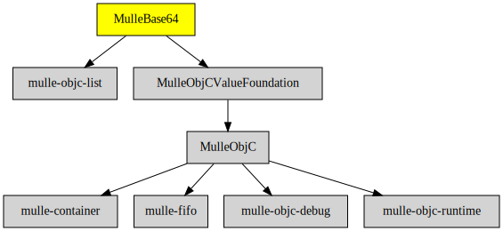

# MulleBase64

#### 💬 Decode and encode NSData with base64

Adds [base64](https://en.wikipedia.org/wiki/Base64) coding and decoding support
to **NSData**.


### You are here




## Add

Use [mulle-sde](//github.com/mulle-sde) to add MulleBase64 to your project:

``` console
mulle-sde dependency add --objc --github MulleWeb MulleBase64
```

## Install

### mulle-sde

Use [mulle-sde](//github.com/mulle-sde) to build and install MulleBase64
and all its dependencies:

```
mulle-sde install --prefix /usr/local \
   https://github.com/MulleWeb/MulleBase64/archive/latest.tar.gz
```

### Manual Installation


Install the requirements:

Requirements                                      | Description
--------------------------------------------------|-----------------------
[some-requirement](//github.com/some/requirement) | Some requirement

Install into `/usr/local`:

``` sh
cmake -B build \
      -DCMAKE_INSTALL_PREFIX=/usr/local \
      -DCMAKE_PREFIX_PATH=/usr/local \
      -DCMAKE_BUILD_TYPE=Release &&
cmake --build build --config Release &&
cmake --install build --config Release
```
