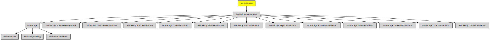

# MulleBase64

#### 💬 Decode and encode NSData with base64

Adds [base64](https://en.wikipedia.org/wiki/Base64) coding and decoding support
to **NSData**.


| Release Version                                       | Release Notes  | AI Documentation
|-------------------------------------------------------|----------------|---------------
|  [](//github.com/MulleWeb/MulleBase64/actions) | [RELEASENOTES](RELEASENOTES.md) | [DeepWiki for MulleBase64](https://deepwiki.com/MulleWeb/MulleBase64)


### You are here




## Add

Use [mulle-sde](//github.com/mulle-sde) to add MulleBase64 to your project:

``` sh
mulle-sde add github:MulleWeb/MulleBase64
```

## Install

### Install with mulle-sde

Use [mulle-sde](//github.com/mulle-sde) to build and install MulleBase64 and all dependencies:

``` sh
mulle-sde install --prefix /usr/local \
   https://github.com//MulleBase64/archive/latest.tar.gz
```

### Manual Installation

Install the requirements:

| Requirements                                 | Description
|----------------------------------------------|-----------------------
| [MulleFoundationBase](https://github.com/MulleFoundation/MulleFoundationBase)             | 🧱 MulleFoundationBase amalgamates Foundations projects
| [mulle-objc-list](https://github.com/mulle-objc/mulle-objc-list)             | 📒 Lists mulle-objc runtime information contained in executables.

Download the latest [tar](https://github.com/MulleWeb/MulleBase64/archive/refs/tags/latest.tar.gz) or [zip](https://github.com/MulleWeb/MulleBase64/archive/refs/tags/latest.zip) archive and unpack it.

Install **MulleBase64** into `/usr/local` with [cmake](https://cmake.org):

``` sh
PREFIX_DIR="/usr/local"
cmake -B build                               \
      -DMULLE_SDK_PATH="${PREFIX_DIR}"       \
      -DCMAKE_INSTALL_PREFIX="${PREFIX_DIR}" \
      -DCMAKE_PREFIX_PATH="${PREFIX_DIR}"    \
       -DCMAKE_BUILD_TYPE=Release &&
cmake --build build --config Release &&
cmake --install build --config Release
```

### Platforms and Compilers

All platforms and compilers supported by
[mulle-c11](//github.com/mulle-c/mulle-c11).


## Author

[Nat!](https://mulle-kybernetik.com/weblog) for Mulle kybernetiK  

